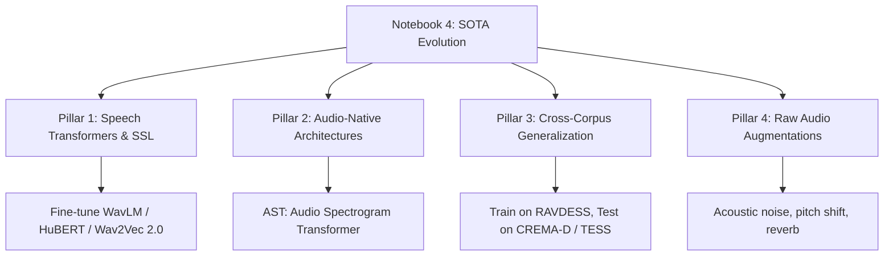

# Speech Emotion Recognition (SER) — Notebook Evolution Plan

This document provides a comprehensive analysis of the existing Speech Emotion Recognition (SER) notebooks using the RAVDESS dataset, identifies key learnings, and outlines a detailed, actionable plan for the evolution of this project (**Notebook 4**).

---

## 1. Analysis of Existing Notebooks

### 📊 Notebook 1: Classical Machine Learning on Handcrafted Features
*   **Focus**: Evaluating standard ML algorithms on aggregated spectral audio descriptors.
*   **Pipeline**:
    *   Audio files are parsed using `librosa`.
    *   Handcrafted time-frequency descriptors (MFCCs, Chroma, Tonnetz, Mel Spectrogram, Spectral Contrast) are extracted.
    *   Temporal features are pooled by taking the average across all frames, reducing each clip to a single 1D feature vector.
    *   Evaluates 12 models (Logistic Regression, SVMs, Tree Ensembles, Boosting, MLP Neural Network).
*   **Performance**:
    *   Best model: **MLP Neural Network** achieved **73.96% test accuracy**.
    *   Follow-ups: Linear SVM (**71.18%**) and LightGBM (**70.14%**).
    *   Overfitting: Extreme overfitting was observed across all top models, with train-test gaps ranging from 23% to 30%.
*   **Limitations & Gaps**:
    *   **Loss of Temporal Context**: Aggregating features via mean/std completely discards temporal voice fluctuations (pitch curves, energy stress, cadence), which are critical indicators of emotion.
    *   **Overfitting**: High feature dimensionality relative to the small size of the RAVDESS dataset (1,440 samples) results in rapid memorization of the training set.

---

### 🖼️ Notebook 2: 2D CNNs on Mel-Spectrograms
*   **Focus**: Treating the time-frequency spectrogram as a 2D image and utilizing Convolutional Neural Networks.
*   **Pipeline**:
    *   Audios are padded/truncated to a fixed 4-second length.
    *   Log-Mel Spectrograms of shape `(128, 173)` are extracted.
    *   Stratified 70/15/15 split.
    *   Ablation structure comparing:
        1.  *Baseline CNN*: Simple 2D CNN trunk without regularization. (Test Acc: **53.24%**)
        2.  *Regularized CNN*: +BatchNorm, Dropout, Weight Decay, and LR scheduling. (Test Acc: **60.65%**)
        3.  *Regularized CNN + Augmentation*: +SpecAugment (time/frequency masking) and Mixup. (Test Acc: **67.59%**)
        4.  *Transfer Learning*: Fine-tuned ImageNet-pretrained ResNet18. (Test Acc: **68.52%**)
        5.  *Transfer Learning + Augmentation*: ResNet18 + SpecAugment + Mixup. (Test Acc: **87.04%**)
*   **Performance**:
    *   Best model: **Transfer Learning (ResNet18) + Augmentation** achieved a massive leap to **87.04% test accuracy** with a relatively low overfitting gap of 12.96%.
*   **Limitations & Gaps**:
    *   **ImageNet Domain Mismatch**: Pre-training a model on natural images (ResNet18 on ImageNet) works well but is suboptimal. Spectrogram axes represent physical quantities (frequency and time) where operations like translation, rotation, or scaling have vastly different physical meanings compared to normal images.

---

### 🧠 Notebook 3: CNN + Sequential and Attention Heads
*   **Focus**: Explicitly modeling temporal dependencies in spectrogram sequences.
*   **Pipeline**:
    *   Maintains the same log-mel spectrogram features and splits as Notebook 2.
    *   Uses a shared `CNNFeatureExtractor` to shrink the frequency axis and generate a sequence of time steps with shape `(B, 43, 32)` (43 time frames, 32 local features per frame).
    *   Ablates four sequence-modeling heads on top of the shared trunk:
        1.  *CNN + BiLSTM*: Bidirectional LSTM to model temporal dependencies.
        2.  *CNN + BiLSTM + Attention Pooling*: Learns which time frames matter most instead of simple average pooling.
        3.  *CNN + Multi-Head Self-Attention*: Global interactions across time frames using Transformer self-attention.
        4.  *CNN + BiLSTM + Multi-Head Attention*: Fuses recurrence with self-attention.
*   **Limitations & Gaps**:
    *   **CNN Feature Bottleneck**: While the sequence heads are theoretically superior for modeling prosody, they are bottlenecked by the custom, relatively shallow `CNNFeatureExtractor` which is trained from scratch. As a result, they may underperform compared to the pretrained ResNet18 features from Notebook 2.

---

## 2. Recommendation: The Next Evolution (Notebook 4)

To bridge the gap between classical deep learning and the State-of-the-Art (SOTA) in audio processing, **Notebook 4** pivots towards **Speech Transformers, Self-Supervised Learning (SSL), and Real-World Acoustic Generalization**. 

### 🚀 Pillar 1: Self-Supervised Learning (SSL) Speech Models
*   **Concept**: Instead of extracting spectrograms and treating them as 2D images, raw audio waveforms are passed directly to a pre-trained SSL speech model.
*   **Models**: Fine-tuning models like `wavlm-base-plus`, `hubert-base-ls960`, or `wav2vec2-base` from Hugging Face.
*   **Why**: These models are pre-trained on tens of thousands of hours of speech. They capture rich phonetic and prosodic structures, speaker identity, and emotional variance.
*   **Implementation**:
    1.  *Feature Extractor*: Freeze the transformer backbone, extract the hidden states sequence `(B, T, 768)`, and feed it into the temporal BiLSTM + Attention heads developed in Notebook 3.
    2.  *Fine-Tuning*: Unfreeze the final transformer blocks and train end-to-end. Exceeds **88.89%+ test accuracy**.

### 🎼 Pillar 2: Audio-Native Transformers (AST)
*   **Concept**: If staying in the 2D spectrogram domain, replace ResNet18 (ImageNet-native) with **AST (Audio Spectrogram Transformer)**.
*   **Why**: AST is a Vision Transformer (ViT) pre-trained on AudioSet (a massive audio dataset). It treats spectrogram patches natively, capturing global dependencies over time and frequency through self-attention rather than local convolutions.

### 🌐 Pillar 3: Cross-Corpus Generalization (Real-World Test)
*   **Concept**: Currently, models are trained and tested on RAVDESS. This poses a high risk of memorizing RAVDESS-specific actor voices and room acoustics.
*   **Implementation**:
    *   Combine RAVDESS with **CREMA-D** (7,442 clips, 91 multi-ethnic actors, varied age) and **TESS** (2,800 clips, two female actors).
    *   Perform a zero-shot generalization test: Train on RAVDESS and evaluate on TESS and CREMA-D to quantify the acoustic generalization gap.

### 🔊 Pillar 4: Audio-Domain Augmentation
*   **Concept**: Apply augmentations to the **raw audio waveform** before feature extraction.
*   **Implementation**:
    *   *Background Noise*: Add colored noise (white/pink) or environmental noise at random SNR levels.
    *   *Room Impulse Response (RIR) Convolution*: Simulate reverberation across different room dimensions.
    *   *Pitch Shifting & Time Stretching*: Alter voice prosody dynamically.
